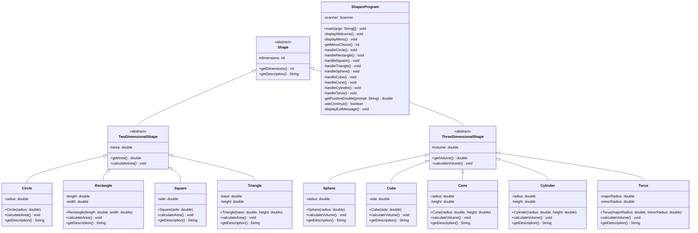

% CMSC 335 Project 1 - UML Class Diagram
% Author: Stefan Nikolov
% Date: March 23, 2026

# UML Class Diagram - Java OO Shapes Program

## Complete Class Hierarchy



---

## Inheritance Relationships (IS-A)

```
Shape (Abstract Base)
│
├─ TwoDimensionalShape (Abstract)
│  ├─ Circle
│  ├─ Rectangle
│  ├─ Square
│  └─ Triangle
│
└─ ThreeDimensionalShape (Abstract)
   ├─ Sphere
   ├─ Cube
   ├─ Cone
   ├─ Cylinder
   └─ Torus
```

---

## Composition Relationships (HAS-A)

- **Shape has** dimensions (int)
- **TwoDimensionalShape has** area (double)
- **ThreeDimensionalShape has** volume (double)

---

## Class Descriptions

### Abstract Classes

**Shape**
- Root abstract class
- Defines common interface for all shapes
- Protected attribute: `dimensions`
- Abstract method: `getDescription()`

**TwoDimensionalShape**
- Extends Shape
- Represents all 2D geometric shapes
- Protected attribute: `area`
- Abstract method: `calculateArea()`

**ThreeDimensionalShape**
- Extends Shape
- Represents all 3D geometric shapes
- Protected attribute: `volume`
- Abstract method: `calculateVolume()`

### 2D Shape Classes

| Class | Attributes | Formula |
|-------|-----------|---------|
| Circle | radius | π × r² |
| Rectangle | length, width | length × width |
| Square | side | side² |
| Triangle | base, height | (base × height) / 2 |

### 3D Shape Classes

| Class | Attributes | Formula |
|-------|-----------|---------|
| Sphere | radius | (4/3) × π × r³ |
| Cube | side | side³ |
| Cone | radius, height | (1/3) × π × r² × h |
| Cylinder | radius, height | π × r² × h |
| Torus | majorRadius, minorRadius | (π × r²) × (2 × π × R) |

### Driver Class

**ShapesProgram**
- Main entry point for the application
- Implements menu system
- Handles user input and validation
- Manages shape instantiation and calculation display
- 15 private static methods for modular design

---

## Design Patterns Applied

1. **Template Method Pattern**: Abstract methods in base classes
2. **Strategy Pattern**: Different calculation algorithms per shape
3. **Factory-like Pattern**: Menu-driven shape creation
4. **Single Responsibility**: Each class has one purpose

---

## Key Design Principles

✅ **DRY (Don't Repeat Yourself)**: Common logic in base classes  
✅ **Encapsulation**: Protected attributes, public interface  
✅ **Abstraction**: Abstract base classes define contracts  
✅ **Polymorphism**: Shape-specific implementations  
✅ **Inheritance Hierarchy**: 3 levels of inheritance for organized structure

