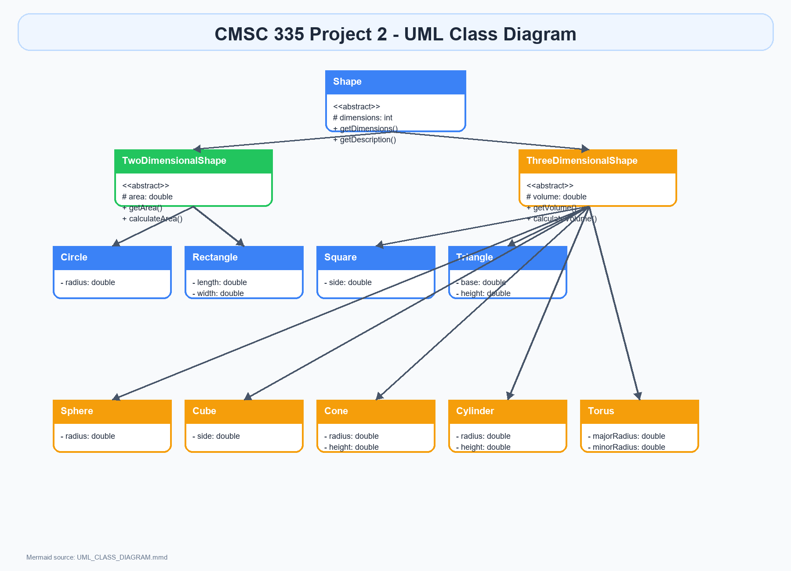
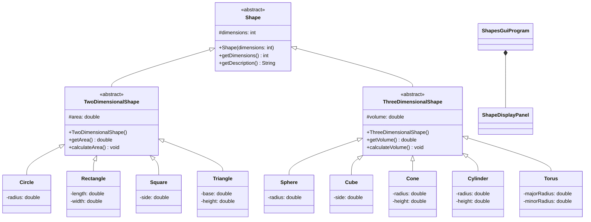

# UML Class Diagram

## Diagram Image

## Mermaid Diagram

```mermaid
classDiagram
    class Shape {
        <<abstract>>
        #dimensions: int
        +Shape(dimensions: int)
        +getDimensions() int
        +getDescription() String
    }

    class TwoDimensionalShape {
        <<abstract>>
        #area: double
        +TwoDimensionalShape()
        +getArea() double
        +calculateArea() void
    }

    class ThreeDimensionalShape {
        <<abstract>>
        #volume: double
        +ThreeDimensionalShape()
        +getVolume() double
        +calculateVolume() void
    }

    class Circle {
        -radius: double
    }
    class Rectangle {
        -length: double
        -width: double
    }
    class Square {
        -side: double
    }
    class Triangle {
        -base: double
        -height: double
    }
    class Sphere {
        -radius: double
    }
    class Cube {
        -side: double
    }
    class Cone {
        -radius: double
        -height: double
    }
    class Cylinder {
        -radius: double
        -height: double
    }
    class Torus {
        -majorRadius: double
        -minorRadius: double
    }

    class ShapeDisplayPanel
    class ShapesGuiProgram

    Shape <|-- TwoDimensionalShape
    Shape <|-- ThreeDimensionalShape

    TwoDimensionalShape <|-- Circle
    TwoDimensionalShape <|-- Rectangle
    TwoDimensionalShape <|-- Square
    TwoDimensionalShape <|-- Triangle

    ThreeDimensionalShape <|-- Sphere
    ThreeDimensionalShape <|-- Cube
    ThreeDimensionalShape <|-- Cone
    ThreeDimensionalShape <|-- Cylinder
    ThreeDimensionalShape <|-- Torus

    ShapesGuiProgram *-- ShapeDisplayPanel
```

## Source File
- UML_CLASS_DIAGRAM.mmd
- UML_CLASS_DIAGRAM.png
