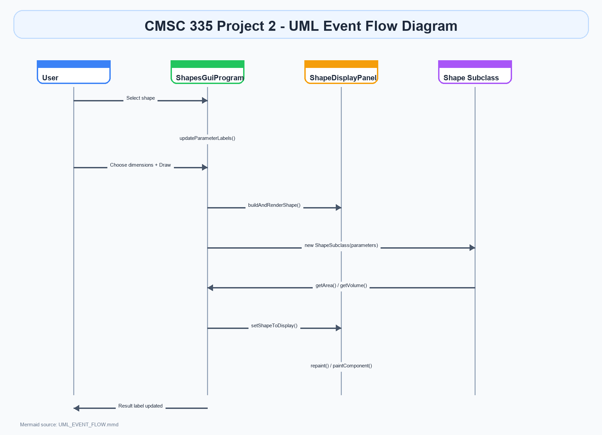
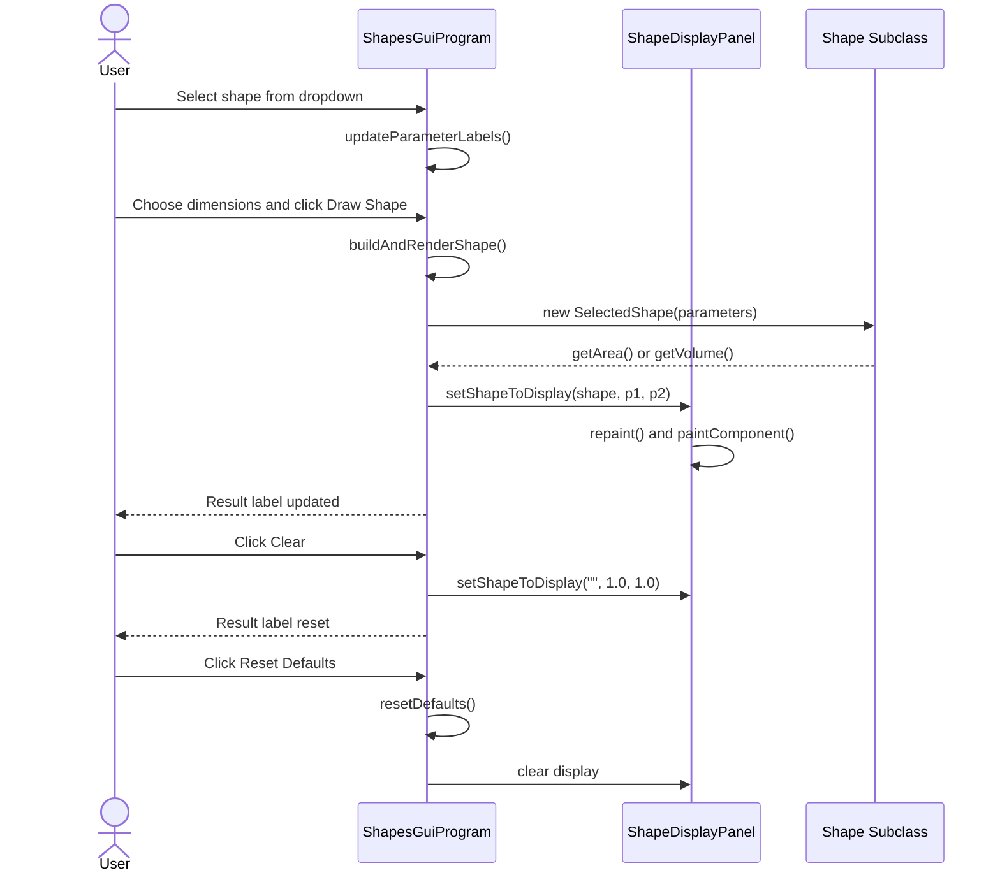

# UML Event Flow Diagram

## Diagram Image

## Mermaid Sequence Diagram

```mermaid
sequenceDiagram
    actor User
    participant GUI as ShapesGuiProgram
    participant Panel as ShapeDisplayPanel
    participant Shape as Shape Subclass

    User->>GUI: Select shape from dropdown
    GUI->>GUI: updateParameterLabels()

    User->>GUI: Choose dimensions and click Draw Shape
    GUI->>GUI: buildAndRenderShape()
    GUI->>Shape: new SelectedShape(parameters)
    Shape-->>GUI: getArea() or getVolume()
    GUI->>Panel: setShapeToDisplay(shape, p1, p2)
    Panel->>Panel: repaint() and paintComponent()
    GUI-->>User: Result label updated

    User->>GUI: Click Clear
    GUI->>Panel: setShapeToDisplay("", 1.0, 1.0)
    GUI-->>User: Result label reset

    User->>GUI: Click Reset Defaults
    GUI->>GUI: resetDefaults()
    GUI->>Panel: clear display
```

## Source File
- UML_EVENT_FLOW.mmd
- UML_EVENT_FLOW.png
